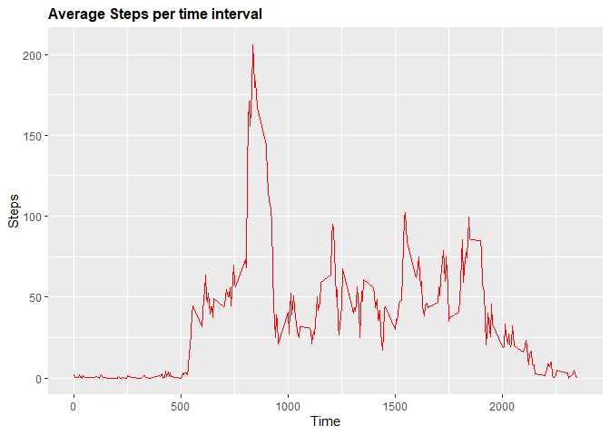

## R Markdown

This is an R Markdown document. Markdown is a simple formatting syntax for authoring HTML, PDF, and MS Word documents. For more details on using R Markdown see <http://rmarkdown.rstudio.com>.

When you click the **Knit** button a document will be generated that includes both content as well as the output of any embedded R code chunks within the document. You can embed an R code chunk like this:


```r
setwd("C:\\Users\\vsahasrabuddhe\\Documents\\Assignments\\Reproducible Research\\Wk2")

install.packages("plyr",repos = "http://cran.us.r-project.org")
```

```
## Installing package into 'C:/Users/vsahasrabuddhe/Documents/R/win-library/3.6'
## (as 'lib' is unspecified)
```

```
## package 'plyr' successfully unpacked and MD5 sums checked
## Warning in install.packages :
##   cannot remove prior installation of package 'plyr'
## Warning in install.packages :
##   problem copying C:\Users\vsahasrabuddhe\Documents\R\win-library\3.6\00LOCK\plyr\libs\i386\plyr.dll to C:\Users\vsahasrabuddhe\Documents\R\win-library\3.6\plyr\libs\i386\plyr.dll: Permission denied
## Warning in install.packages :
##   restored 'plyr'
## 
## The downloaded binary packages are in
## 	C:\Users\vsahasrabuddhe\AppData\Local\Temp\Rtmpa0lNry\downloaded_packages
```

```r
library("plyr")

library("dplyr")
```

```
## 
## Attaching package: 'dplyr'
```

```
## The following objects are masked from 'package:plyr':
## 
##     arrange, count, desc, failwith, id, mutate, rename, summarise, summarize
```

```
## The following objects are masked from 'package:stats':
## 
##     filter, lag
```

```
## The following objects are masked from 'package:base':
## 
##     intersect, setdiff, setequal, union
```

```r
install.packages("ggplot2",repos = "http://cran.us.r-project.org")
```

```
## Installing package into 'C:/Users/vsahasrabuddhe/Documents/R/win-library/3.6'
## (as 'lib' is unspecified)
```

```
## package 'ggplot2' successfully unpacked and MD5 sums checked
## 
## The downloaded binary packages are in
## 	C:\Users\vsahasrabuddhe\AppData\Local\Temp\Rtmpa0lNry\downloaded_packages
```

```r
library("ggplot2")

## 1. Import Data and check first few rows

data <- read.csv("activity.csv")
data$date <- as.Date(data$date)
head(data)
```

```
##   steps       date interval
## 1    NA 2012-10-01        0
## 2    NA 2012-10-01        5
## 3    NA 2012-10-01       10
## 4    NA 2012-10-01       15
## 5    NA 2012-10-01       20
## 6    NA 2012-10-01       25
```

## 2. Total number of steps taken per day

##  (a) Calculate Total No Of Steps taken per day and change the column names appropriately


```r
StepPerDay <- aggregate(data$steps,by=list(data$date),FUN=sum)

colnames(StepPerDay) <- c("date","steps")
```
##  (b) Make a histogram of the total number of steps taken each day


```r
ggplot(StepPerDay,aes(steps))+geom_histogram(binwidth=2500,col="red",fill="blue")+scale_x_continuous(breaks=seq(0,25000,2500))+scale_y_continuous(breaks=seq(0,18,2))+ggtitle("Histogram of Steps per day")+ xlab("steps")+ylab("Frequency")
```

```
## Warning: Removed 8 rows containing non-finite values (stat_bin).
```

<!-- -->

##  (c) Calculate and report the mean and median of the total number of steps taken per day.


```r
mean(StepPerDay$steps,na.rm=TRUE)
```

```
## [1] 10766.19
```

```r
median(StepPerDay$steps,na.rm=TRUE)
```

```
## [1] 10765
```


## 3. Average daily activity pattern

## (a) Time series plot of the 5-minute interval (x-axis) and the average number of steps taken, averaged across all days (y-axis).


```r
AvgStepsPerInterval <- aggregate(data$steps,by=list(data$interval),FUN=mean, na.rm=TRUE)

colnames(AvgStepsPerInterval) <- c("interval","avgsteps")

ggplot(AvgStepsPerInterval, aes(interval, avgsteps)) + geom_line(col="red")+ggtitle("Average steps per time interval")+xlab("Time")+ylab("Steps")+theme(plot.title = element_text(face="bold", size=12))
```

<!-- -->

## (b) 5-minute interval, which on average across all the days in the dataset, contains the maximum number of steps.

```r
maxSteps <- AvgStepsPerInterval[AvgStepsPerInterval$avgsteps == max(AvgStepsPerInterval$avgsteps),]
maxSteps
```

```
##     interval avgsteps
## 104      835 206.1698
```


## 4. Inputting missing Values.

##(a) the total number of rows with \color{red}{\verb|NA|}NAs.


```r
sapply(data,function(x) sum(is.na(x)))
```

```
##    steps     date interval 
##     2304        0        0
```
##(b) For replcaing missing values, we can use the avg no of steps taken for that particular interval. New data set is created with the missing data updated.


```r
data_mvr <- join(data, AvgStepsPerInterval)
```

```
## Joining by: interval
```

```r
data_mvr  <- data_mvr  %>% mutate(steps=ifelse(is.na(steps),avgsteps,steps))
```
##(b)  histogram of the total number of steps taken each day with missing data filled in.

```r
StepPerDay_mvr <- aggregate(data_mvr$steps,by=list(data_mvr$date),FUN=sum)

colnames(StepPerDay_mvr) <- c("date","tot_steps")

ggplot(StepPerDay_mvr,aes(tot_steps))+geom_histogram(binwidth=2500,col="red",fill="blue")+scale_x_continuous(breaks=seq(0,25000,2500))+scale_y_continuous(breaks=seq(0,26,2))+ggtitle("Histogram of Steps per day")+ xlab("steps")+ylab("Frequency")
```

<!-- -->
##(C)  Display Mean and Median values of the Steps with missing data filled in.

```r
mean(StepPerDay_mvr$tot_steps)
```

```
## [1] 10766.19
```

```r
median(StepPerDay_mvr$tot_step)
```

```
## [1] 10766.19
```

## 5. Activity patterns between weekdays and weekends.


```r
data_mvr$daytype <- weekdays(data_mvr$date)

weekdayNames <- c('Monday', 'Tuesday', 'Wednesday', 'Thursday', 'Friday')

data_mvr$daytype1 <- c('weekend','weekday')[(weekdays(data_mvr$date) %in% weekdayNames)+1L]

AvgStepPerDayType <- aggregate(data_mvr[,1],by=list(data_mvr$daytype1,data_mvr$interval),FUN=mean)

colnames(AvgStepPerDayType) <- c("day_type","interval","avg_steps")

ggplot(AvgStepPerDayType,aes(interval,avg_steps))+geom_line(col="blue")+facet_grid(day_type~.) +ggtitle("Average steps per time interval")+xlab("Time Interval")+ylab("Avg # of Steps")
```

<!-- -->

## testing commit
